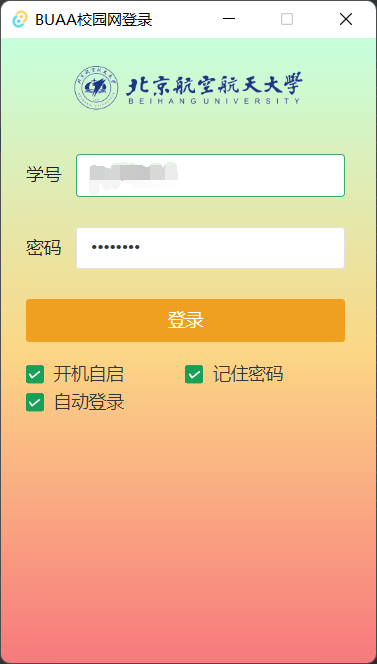
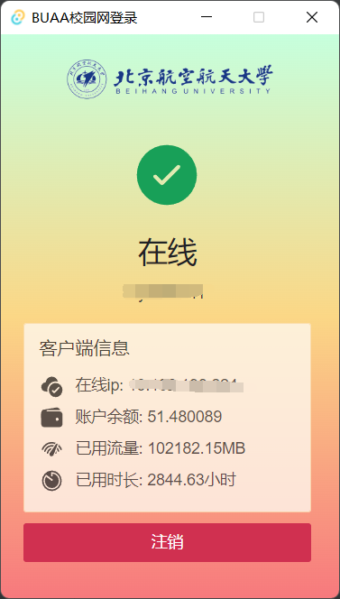

# buaa-login

一个简单的BUAA校园网登录客户端。起因是希望人不在电脑边，设置了bios电脑通电自动开机后，可以自动登录以便使用向日葵等远程软件。
> 记得以前在登录界面可以下载一个srun3000客户端，但是现在找不到了，索性自己写一个吧

## 功能
* 登录校园网
* 自动登录
* 开机自启

## 截图

## 贡献
基于[tauri](https://tauri.app/)和[vue3](https://v3.cn.vuejs.org/)以及[naiveui](https://www.naiveui.com/zh-CN/os-theme)。欢迎试用、issue和pr。

